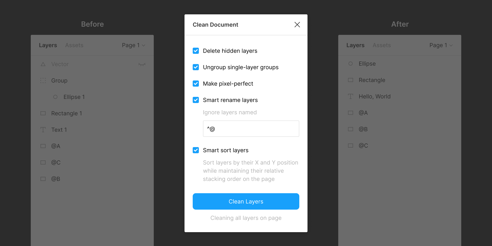

# Clean Document 

> A Figma plugin to automagically organize and clean up your Figma document

## Commands

### Delete Hidden Layers

Deletes all hidden layers within the selection or on the current page.

### Ungroup Single-Layer Groups

Ungroups single-layer groups within the selection or on the current page that have no background, blend mode, effect or export setting.

### Make Pixel Perfect

Rounds the X and Y position and dimensions of layers within the selection or on the current page to the nearest pixel.

### Smart Rename Layers

Intelligently renames layers within the selection or on the current page.

- Layers of type `Text` will be named based on their text content.
- Layers of type `Instance` will be given the same name as their Master Component.
- Layers of all other layer types will be named based on their layer type. (For example, a layer of type `Rectangle` will be named “Rectangle”, a layer of type `Group` will be named “Group”, and so on.)
- Layers with export settings will not be renamed.

Optionally specify a whitelist Regular Expression to skip the renaming of particular layers.

### Smart Sort Layers

Sort layers within the selection or on the current page by their X and Y position while maintaining their relative stacking order on the page.

### Clean Layers

Run all the above commands on layers within the selection or on the current page.

### Sort Pages

Sorts pages of the current document in alphabetical order.

## License

MIT
