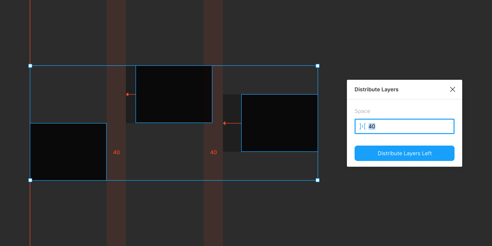

# Distribute Layers  

> A Figma plugin to distribute layers in a given direction and offset

## Commands

### Distribute Layers Left / Right / Up / Down

Distributes the selected layers leftwards, rightwards, upwards, or downwards by a specified pixel offset.

## License

MIT
