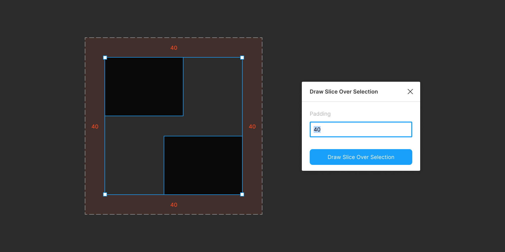

# Draw Slice Over Selection 

> A Figma plugin to draw a slice over the selection

## Commands

### Draw Slice Over Selection

Draws a slice over the selected layers. Optionally specify a padding for the slice.

## License

MIT
