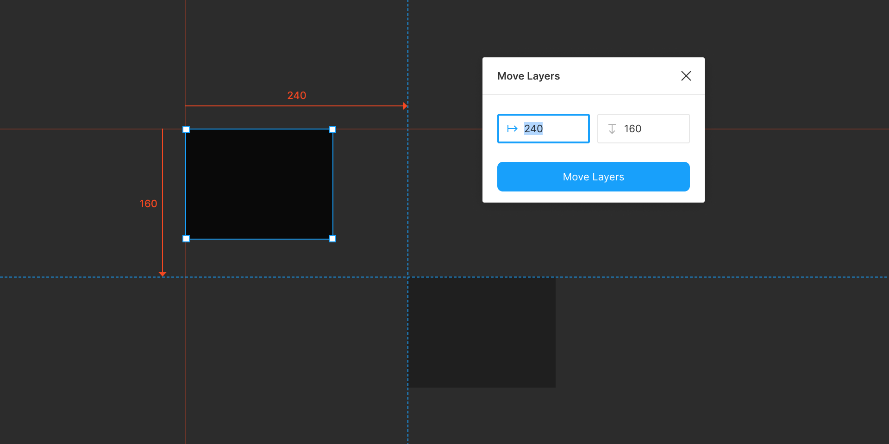

# Move Layers 

> A Figma plugin to precisely move layers

## Commands

### Move Layers

Moves the selected layers leftwards/rightwards or upwards/downwards by a specified pixel offset.

## License

MIT
