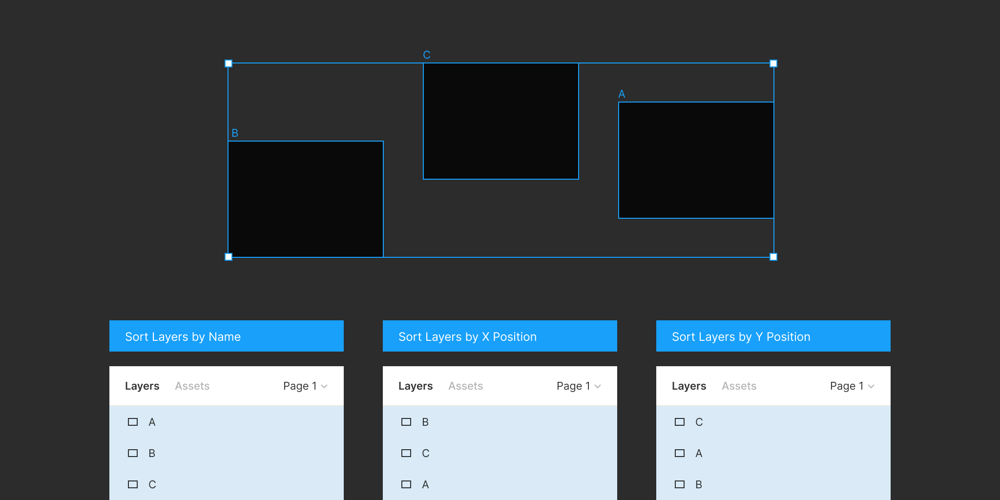

# Sort Layers  

> A Figma plugin to sort layers by name or position

## Commands

### Sort Layers by Name

Sort the selected layers in alphabetical order.

### Sort Layers by X Position

Sort the selected layers by their X position.

### Sort Layers by Y Position

Sort the selected layers by their Y position.

### Smart Sort Layers

Sort the selected layers by their X and Y position while maintaining their relative stacking order on the page.

## License

MIT
